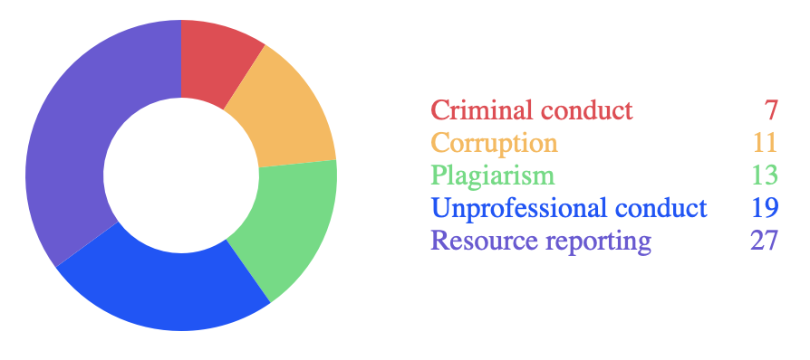

# NanoChart

This PHP class builds a simple pie or doughnut chart as an SVG with a text legend.

## Features

1. Pass in an associative array of items and their amounts, and NanoChart creates the chart.
2. Pass in your own colour palette to overide the default colours, or set your own hue value and NanoChart will create a palette.
3. The legend can be to the right or below the chart (using CSS flexbox row or column).
4. The output is HTML with inline styles.

## Screenshot



## Usage

**Prepare an associative array of names and amounts:**
```php
    $items = [
        'Monday' => 10,
        'Tuesday' => 20,
        'Wednesday' => 30
    ];
```

**Instantiate NanoChart and pass in the array:**
```php
    $nanoChart = new NanoChart($items);
```

**Customise with setters:**
```php
    $nanoChart->setSize(250); // width and height in pixels
    $nanoChart->setDirection('column'); // CSS flexbox direction options
    $nanoChart->setStyle('doughnut'); // change from a basic pie chart to a doughnut chart
    $nanoChart->setHue(150); // set the hue value for the colour palette
    $nanoChart->setPalette($palette); //pass in a simple array of colours to use for the items
```

## Examples

See [examples.php](examples.php) for different ways the class can be used.

## Dependencies

Requires PHP 7.4 or later.

## License

This project is licensed under the MIT License.

## Acknowledgments

Feel free to contribute, report issues, or suggest improvements!
